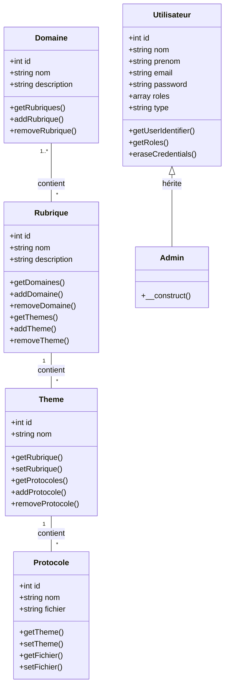

# Diagramme UML - Le Repère des Protocoles

## Modèle de données

Ce diagramme présente la structure complète des entités et leurs relations.



## Légende

- **Relation ManyToMany** : Domaine ↔ Rubrique (une rubrique peut appartenir à plusieurs domaines et un domaine peut contenir plusieurs rubriques)
- **Relation OneToMany** : Rubrique → Theme (une rubrique contient plusieurs thèmes)
- **Relation OneToMany** : Theme → Protocole (un thème contient plusieurs protocoles)
- **Héritage** : Admin hérite de Utilisateur (Single Table Inheritance)

## Hiérarchie

```
Domaine (1..*) → Rubrique (*) → Theme (1) → Protocole (*)
                     ↓
                   Thème (1)
                     ↓
                 Protocole (*)
```

## Description des relations

### Domaine ↔ Rubrique (ManyToMany)
- Un domaine peut contenir plusieurs rubriques
- Une rubrique peut appartenir à plusieurs domaines
- Table de liaison : `rubrique_domaine`

### Rubrique → Theme (OneToMany)
- Une rubrique contient plusieurs thèmes
- Un thème appartient à une seule rubrique

### Theme → Protocole (OneToMany)
- Un thème contient plusieurs protocoles
- Un protocole appartient à un seul thème

### Utilisateur → Admin (Héritage)
- Admin hérite de toutes les propriétés de Utilisateur
- Stockage dans une seule table avec un discriminator `type`
- Admin possède automatiquement le rôle `ROLE_ADMIN`
