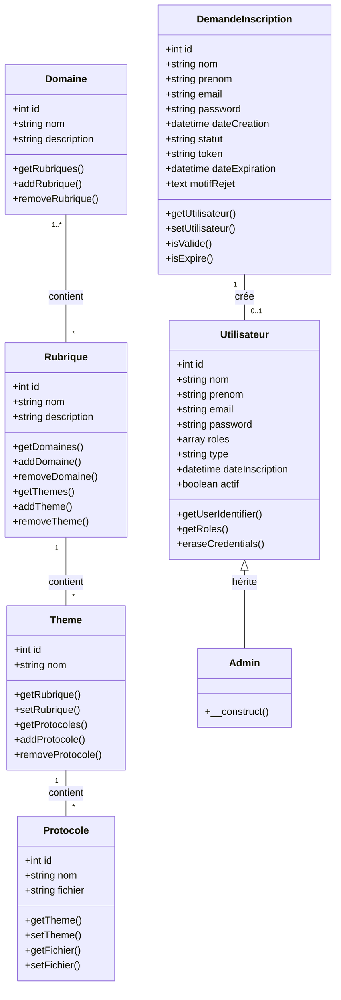

# Diagramme UML - Le Repère des Protocoles

## Modèle de données

Ce diagramme présente la structure complète des entités et leurs relations.

```mermaid
classDiagram
    class Domaine {
        +int id
        +string nom
        +string description
        +getRubriques()
        +addRubrique()
        +removeRubrique()
    }
    
    class Rubrique {
        +int id
        +string nom
        +string description
        +getDomaines()
        +addDomaine()
        +removeDomaine()
        +getThemes()
        +addTheme()
        +removeTheme()
    }
    
    class Theme {
        +int id
        +string nom
        +getRubrique()
        +setRubrique()
        +getProtocoles()
        +addProtocole()
        +removeProtocole()
    }
    
    class Protocole {
        +int id
        +string nom
        +string fichier
        +getTheme()
        +setTheme()
        +getFichier()
        +setFichier()
    }
    
    class DemandeInscription {
        +int id
        +string nom
        +string prenom
        +string email
        +string password
        +datetime dateCreation
        +string statut
        +string token
        +datetime dateExpiration
        +text motifRejet
        +getUtilisateur()
        +setUtilisateur()
        +isValide()
        +isExpire()
    }
    
    class Utilisateur {
        +int id
        +string nom
        +string prenom
        +string email
        +string password
        +array roles
        +string type
        +datetime dateInscription
        +boolean actif
        +getUserIdentifier()
        +getRoles()
        +eraseCredentials()
    }
    
    class Admin {
        +__construct()
    }
    
    Domaine "1..*" -- "*" Rubrique : contient
    Rubrique "1" -- "*" Theme : contient
    Theme "1" -- "*" Protocole : contient
    DemandeInscription "1" -- "0..1" Utilisateur : crée
    Utilisateur <|-- Admin : hérite

```

## Légende

- **Relation ManyToMany** : Domaine ↔ Rubrique
- **Relation OneToMany** : Rubrique → Theme
- **Relation OneToMany** : Theme → Protocole
- **Relation OneToOne** : DemandeInscription → Utilisateur
- **Héritage** : Admin hérite de Utilisateur (Single Table Inheritance)

## Description des relations

### DemandeInscription → Utilisateur (OneToOne optionnelle)
- Une demande d'inscription crée **zéro ou un** Utilisateur
- Un utilisateur est créé à partir d'**une seule** DemandeInscription
- Statuts possibles : `en_attente`, `approuvee`, `rejetee`
- Après approbation, un Utilisateur est créé avec le rôle `ROLE_USER`

### Workflow d'enregistrement

1. **Créer DemandeInscription** : L'utilisateur soumet son formulaire d'inscription
   - Token généré pour la vérification d'email
   - Statut initial : `en_attente`
   - Date d'expiration : 24-48h

3. **Acceptée/Refusée** : L'admin traite la demande
   - **Acceptée** : Créer un Utilisateur avec les données de DemandeInscription
   - **Refusée** : Stocker le motif de rejet, statut = `rejetee`

4. **Activer Utilisateur** : Une fois approuvé, l'utilisateur peut se connecter

### Utilisateur (propriétés complètes)
- Héritage : Admin hérite de Utilisateur (Single Table Inheritance)
- Stockage dans une seule table avec un discriminator `type`
- Admin possède automatiquement le rôle `ROLE_ADMIN`